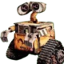

<h1 align="center">jogo da velha Web</h1>

Este é um divertido projeto web que posso destacar alguns pontos : 
1 - Ele é um jogo da velha web que pode ser jogado contra uma pessoa ou contra um boot. 
2 - Seus efeitos visuais contam com imagens, gifs, cores e formas para criar um vínculo de cativação com o usuário. 🦊  
3 - O boot pode alternar entre modos fácil,médio ou difícil de forma aleátoria, mudando de estratégias e estilo de jogadas. 🤖  
4 - Conta também com áudios de memes que o torna único garantindo uma divertida experiência; seus áudios são introduzidos de forma a interagir com a atual condição do usuário seja com sons de comemoração, derrota, empate e até mesmmo zuando com o usuário. 😹  

Ficou curioso ?  

<a href="https://jogodavelha-lg.netlify.app/"><i>click aqui para ver o site</i></a>

## Instalação Local
### Download
    git clone https://github.com/Lucas836-hub/jogo-da-velha-web/
### Abrir a pasta
    cd jogo-da-velha
### Execultando o Arquivo
    open index.html

